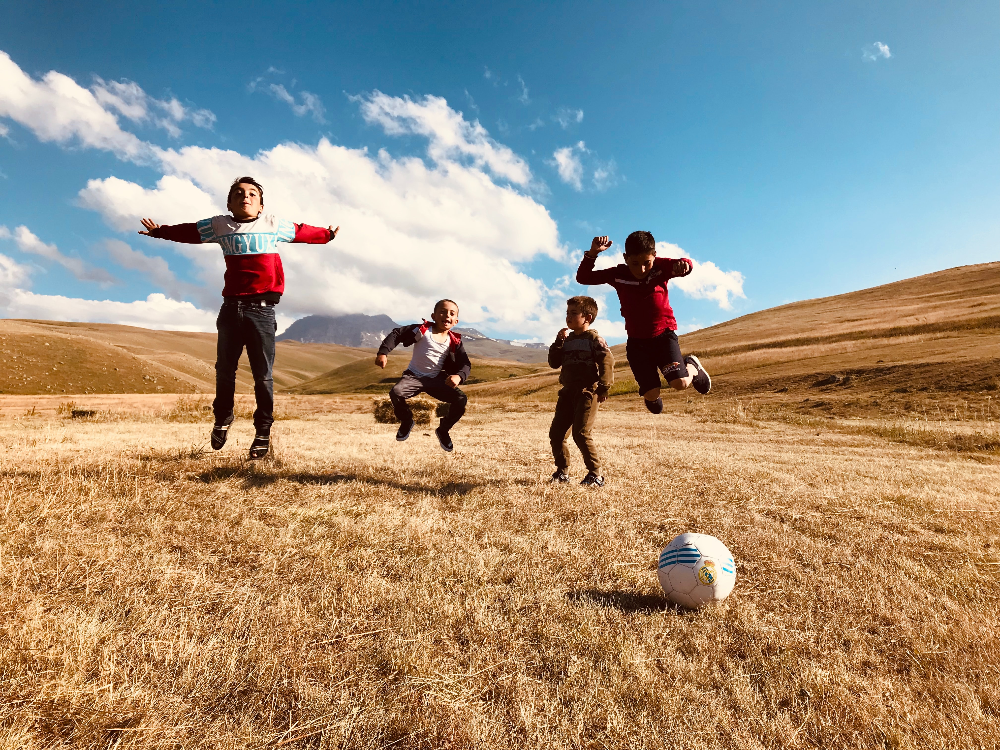

## STAGES DE CONGES SCOLAIRES

Les stages sportifs et de loisirs ** de congés scolaires** sont des moments ** de détente.** Le but est de s’amuser et d’éveiller le sens de ** la créativité **dans le respect de l’autre en compagnie de nos encadrants passionnés.

Nous travaillons en collaboration avec différentes structures scolaires, sportives et fédérations afin de mettre nos adhérents dans les meilleures conditions possible.

Possibilité de combiner deux types de stage à la fois, _« par exemple Sports de combats et Sciences ou Multisports Entrepreneuriat etc… »_.

Multisports - Sports de Combats – Tennis – Football – Sciences – Le Grimoire du Chef – Créativité – Geeks & Codages – Entrepreneuriat – Musique – Chant etc…

Outre le but ludique, d’apprentissage récréative, si vous le souhaitez, nous avons une équipe formée à la détection et à la gestion du talent qui peut vous accompagner, dans la gestion de ce talent, et le cas échéant le diriger vers les structures adéquates.

### FAITES VOTRE CHOIX

| INTITULE            | LIEU        |
| ------------------- | ----------- | 
| MULTISPORTS         | LLN - Wavre | 
| SYNEXCEL ATHLÉTISME | LLN - Wavre | 
| TAEKWONDO           | LLN - Wavre |           
| CARDIO-BOXING       | LLN - Wavre |           
| TAI-JITSU           | LLN - Wavre |  
| FOOTBALL            | LLN - Wavre |  
| MUSIQUE ET CHANT    | LLN - Wavre |           
| THEATRE ET IMPRO    | LLN - Wavre |           
| ART PLASTIQUE       | LLN - Wavre |           
| ECHECS              | LLN - Wavre |           

### MATERIEL

- Pique-nique
- Collations
- Gourde d'eau
- Tenue sportive adaptée
- Matériel spécifique (voir mail)

### GARDERIE
- 8H - 9H 
- 16H - 19H 

N’hésitez pas à nous contacter à ce sujet afin d’obtenir plus amples informations.

## STAGES DE VACANCES SCOLAIRES

### FAITES VOTRE CHOIX

| INTITULE             | LIEU        | 
| -------------------- | ----------- | 
| BUSINESS & SPORTS    | LLN - Wavre | 
| INITIATION AU TENNIS | LLN - Wavre | 
| CODAGE WEB ET SPORT  | LLN - Wavre |           
| TECHNO ET SPORTS     | LLN - Wavre |        
| MULTISPORTS          | LLN - Wavre |
| SYNEXCEL ATHLETISME  | LLN - Wavre |           
| TAEKWONDO            | LLN - Wavre |           
| CARDIO-BOXING        | LLN - Wavre |           
| TAI-JITSU            | LLN - Wavre | 
| FOOTBALL             | LLN - Wavre | 
| MUSIQUE ET CHANT     | LLN - Wavre |           
| THEATRE ET IMPRO     | LLN - Wavre |           
| ART PLASTIQUE        | LLN - Wavre |           
| ECHECS               | LLN - Wavre |           

### MATERIEL

- Pique-nique
- Collations
- Gourde d'eau
- Tenue sportive adaptée
- Matériel spécifique

### GARDERIE
- 8H - 9H 
- 16H - 19H 

## NOUS REJOINDRE
Vous organisez un stage (ou une activité) de qualité ? 
<a href="/nous-rejoindre/">**Rejoignez SYNEXCEL en complétant notre formulaire d'adhésion**</a>