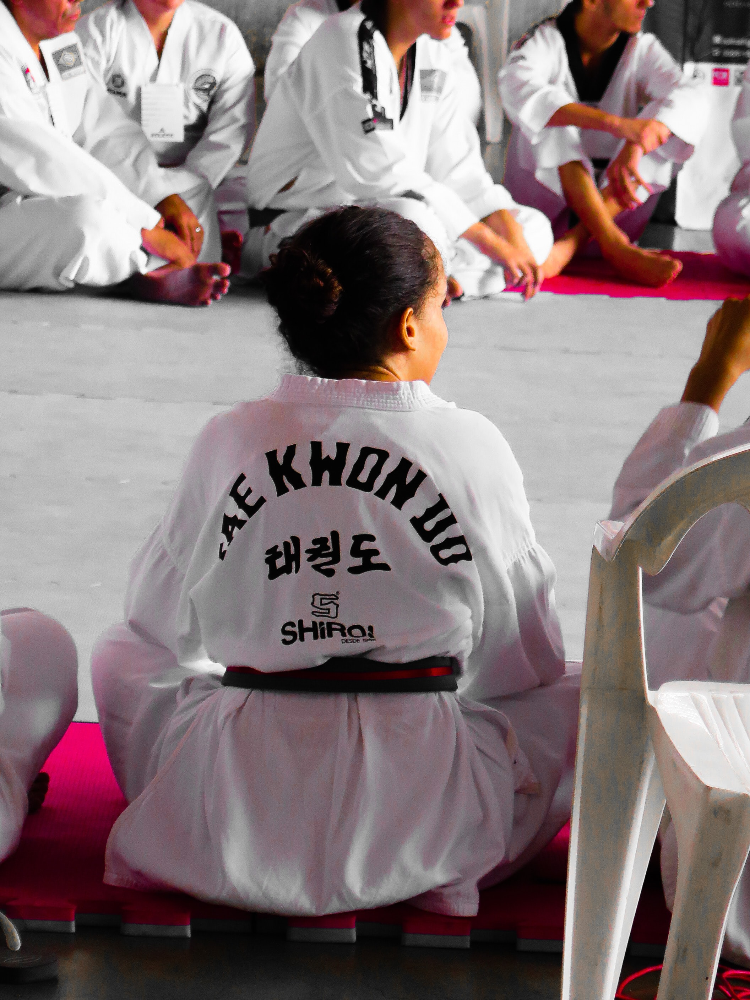

## STAGES SPORTIFS ET DE LOISIRS DE CONGÉS

Les stages sportifs et de loisirs ** de congés scolaires** sont des moments ** de détente.** Le but est de s’amuser et d’éveiller le sens de ** la créativité **dans le respect de l’autre en compagnie de nos encadrants passionnés.

Nous travaillons en collaboration avec différentes structures scolaires, sportives et fédérations. Outre le but ludique, si vous le souhaitez, nous avons une ** équipe formée à la détection et à la gestion** du talent afin le rediriger « la pépite » vers les structures adéquates, si tel est le cas.

## STAGES SPORTIFS ET DE LOISIRS DE VACANCES

Les stages sportifs et de loisirs ** des vacances scolaires** sont des moments ** de découverte.** Le but est de s’amuser, apprendre, éveiller le sens de ** l’entrepreneuriat ** dans le respect de l’autre en compagnie de nos encadrants passionnés.

Nous travaillons en collaboration avec différentes structures scolaires, sportives et fédérations. Outre le but ludique, si vous le souhaitez, nous avons une ** équipe formée à la détection et à la gestion** du talent afin le rediriger « la pépite » vers les structures adéquates, si tel est le cas.

## CATALOGUE DES STAGES

Possibilité de combiner deux types de stage à la fois, <em>« par exemple Sports de combats et Sciences ou Multisports Entrepreneuriat etc… »meow</em>.

Multisports - Sports de Combats – Tennis – Football – Sciences – Le Grimoire du Chef – Créativité – Geeks & Codages – Entrepreneuriat – Musique – Chant etc…
