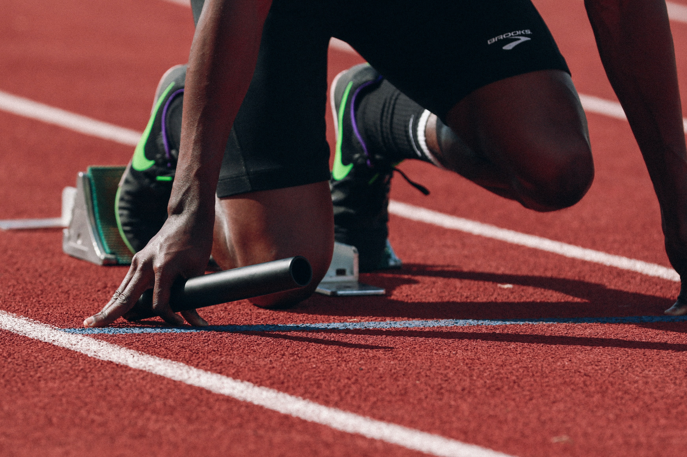

## PARASCOLAIRES (JUNIORS)

Ce pôle contient ** une série d’activités annuelles** multi sportives, artistiques et de loisirs se donnant entre septembre et juin, ** destinée aux enfants à partir de 3 ans**
principalement dans les ** établissements scolaires**, les centres multisports ou auprès de nos clubs partenaires.

### MENU

| INTITULE            | LIEU        | GARDERIES |
| ------------------- | ----------- | --------- |
| MULTISPORTS         | LLN - Wavre | AM        |
| SYNEXCEL ATHLETISME | LLN - Wavre | 8h - 9h   |
| TAEKWONDO           | LLN - Wavre | Weekend   |
| CARDIO-BOXING       | LLN - Wavre |           |
| TAI-JITSU           | LLN - Wavre | PM        |
| FOOTBALL            | LLN - Wavre | 16H - 20H |
| MUSIQUE ET CHANT    | LLN - Wavre | Semaine   |
| THEATRE ET IMPRO    | LLN - Wavre |           |
| ART PLASTIQUE       | LLN - Wavre |           |
| ECHECS              | LLN - Wavre |           |

### MATERIEL

- Pique-nique
- Collations
- Gourde d'eau
- Tenue sportive adaptée
- Matériel spécifique

## CLUBS ET PARTENAIRES (ADULTES)

Ces séances sont ouvertes à toutes les personnes ** aptes à la pratique du sport** à travers de nos séances en clubs. L’objectif est la pratique régulière d’une discipline sportive choisie, avec tout le ** volet apprentissage et investissement** qui en découle… _(exemple passage de ceinture pour le sport de combat)_.

### MENU

| INTITULE            | LIEU        | GARDERIES |
| ------------------- | ----------- | --------- |
| MULTISPORTS         | LLN - Wavre | AM        |
| SYNEXCEL ATHLETISME | LLN - Wavre | 8h - 9h   |
| TAEKWONDO           | LLN - Wavre | Weekend   |
| CARDIO-BOXING       | LLN - Wavre |           |
| TAI-JITSU           | LLN - Wavre | PM        |
| FOOTBALL            | LLN - Wavre | 16H - 20H |
| MUSIQUE ET CHANT    | LLN - Wavre | Semaine   |
| THEATRE ET IMPRO    | LLN - Wavre |           |
| ART PLASTIQUE       | LLN - Wavre |           |
| ECHECS              | LLN - Wavre |           |

### MATERIEL

- Pique-nique
- Collations
- Gourde d'eau
- Tenue sportive adaptée
- Matériel spécifique

## CATALOGUE DES SPORTS ET LOISIRS

> VOULEZ-VOUS DEVENIR **PARTENAIRES DE SYNEXCEL** ET INSCRIRE **VOTRE ACTIVITE DE SPORT OU DE LOISIR ICI,** TRÈS SIMPLE, REMPLISSEZ LE FORMULAIRE DE CONTACT EN DECRIVANT VOTRE PROJET, ET NOS SERVICES VOUS CONTACTERONS POUR UN ÉVENTUELLE CONVENTION DE PARTENARIAT !

Nous voulons être **la référence du sport en Belgique** en ce qui concerne les stages, la détection de talents, le laboratoire d’excellence et de management sportif.

### EN QUELQUES ETAPES

1. Prise de **contact** via le formulaire
2. **Analyse** de la demande
3. Intégration de votre activité telle quelle ou en collaboration avec d'autre **partenaires** en **synergie**
4. Conclusion de la convention, **intégration** et mise en lumière

Nous œuvrons continuellement pour apporter une offre de stage de qualité _en évitant les doublons_.
