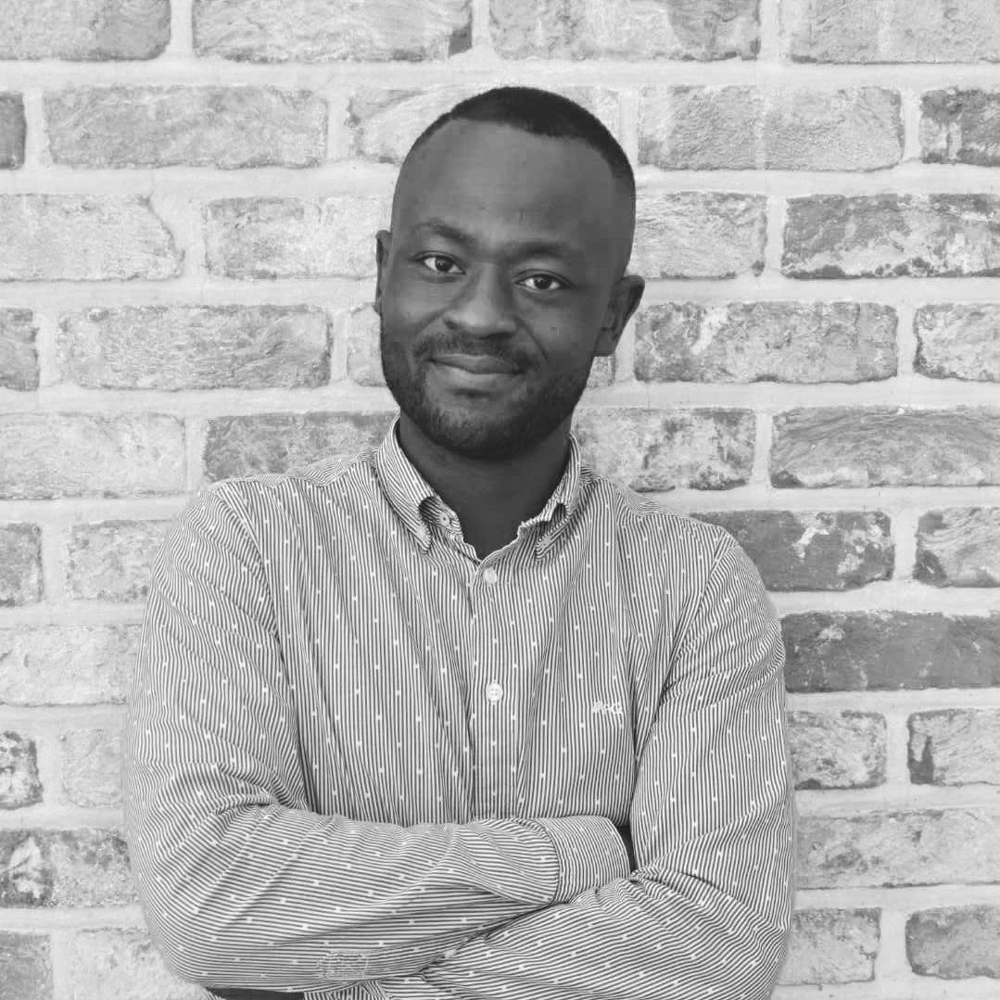

Le projet SYNEXCEL est destiné aux sportifs et aux prestataires qui aspirent à devenir professionnel au sein de leur domaine et qui s’en donnent réellement les moyens. Notons qu’il est essentiel de travailler aussi sur l’environnement dans lequel évoluent ces jeunes talents et promouvoir la culture du sport au sein de sa famille et de son entourage. 

Impossible de parler performance sans évoquer la nutrition ! En effet, elle tient une place centrale dans la pratique du sport et dans les objectifs qui y sont liés. Il est important d’être convenablement informer sur la nature des aliments et les apports nutritifs de ces derniers. 

L’organisation, le ciment entre la passion et les performances, il est aussi un facteur de productivité. Il est important d’outillé nos adhérents à cette réalité. Sans une bonne organisation administrative et financière, même les plus beaux projets risquent de ne jamais voir le jour. 

Sont aussi visés par ce projet : les clubs amateurs ou professionnels, structures sportives, prestataires sportifs, entreprises individuelles, entreprises morales, l’État fédéral, entités fédérées (Communes, Régions, etc..) et aux instances internationales. 

Pour atteindre les objectifs fixés, nous collaborons avec une équipe pluridisciplinaire de passionnée composée d’un Juriste-coordinateur, préparateur-physique, coach personnalisé, coach spécifique, kinésithérapeute, médecin sportif, psychologue du développement et du sport, juristes & avocats toutes spécialités (droit des affaires et contentieux des étrangers), économiste, intermédiaires ou agents sportifs, animateurs sportifs, recruteurs en scouting, professionnels en sport de combat (boxe, tai-jitsu et taekwondo…), experts financier et administratif, expert-comptable, conciliateurs et médiateurs agréés, agents immobiliers et expert en gestion et création d’entreprise.

Nous travaillons en synergie différents experts et d’autres structures existantes afin d’offrir un vaste service de qualité en adéquation avec notre vision. Nous accompagnons nos talents dès leur plus jeune âge avec une pédagogie adaptée.

L’expertise et la passion qui sont les nôtres rendent ce projet unique. Notre expérience et l’écoute des acteurs principaux nous ont permis d’affiner chaque point de ce projet, qui est lui-même d’ailleurs est en constante amélioration.

